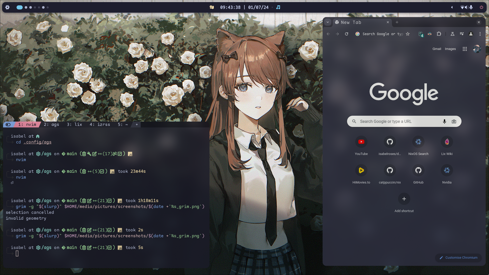

  
  <h1>isabel's dotfiles</h1>

  
  
  
  
  

 

   
more previews

   

      light mode
      
   

   

      wezterm + chromium
      
   

   

      neovim
      
   

<!--toc:start-->

- [Foreword](#foreword)
- [What does this repo provided](#what-does-this-repo-provided)
- [Config layout](#config-layout)
- [Usage Notes](#usage-notes)
  - [Using the templates](#using-the-templates)
  - [Shortcuts](#shortcuts)
  - [Installation Notes](#installation-notes)
    - [NixOS](#nixos)
    - [macOS](#macos)
  - [Small bits](#small-bits)
- [Additional notes](#additional-notes)
  - [Resources](#resources)
  - [People](#people)

<!--toc:end-->

### Foreword

This repository contains my **personal** configuration for my systems. Its really important that you know it's **personal** and not everything will fit your needs or even work out of the box for you without some changes.

> [!WARNING]
> It's also significant to note that this configuration will **not** work if you do not change any of the [secrets](../secrets) since they are encrypted.

> [!TIP]
> You can find some cool blogs and people at the bottom of this file, or [click here](#additional-notes)

### What does this repo provided

- Several applications and tools for the same purpose, so you can choose the one that best suits your needs
  - `neovim`, `micro` and `vscode` for text editing
  - `firefox` and `chromium` for web browsing
  - `alacritty`, `kitty` and `wezterm` for terminal emulators
  - `bash`, `zsh`, `fish` and `nushell` for shells
- Modular configuration, so you can add or remove parts of the configuration
- Sensible defaults, so you can get started quickly
- Docs kind of
- [Catppuccin](https://github.com/catppuccin/catppucin) everywhere, with a hint of [evergarden](https://github.com/comfysage/evergarden)

### Config layout

- 🏠 [home](../home/) Where all home-manager configurations lie
- 🖥️ [systems](../systems/)
  - ☀️ [Amaterasu](../systems/amatarasu/) My high-end gaming machine
  - 🐉 [Hydra](../systems/hydra/) A super mid spec laptop
  - ⚸ [Lilith](../systems/lilith/) A NixOS ISO image that can be quickly deployed and accessed via ssh
  - 🪄 [Luz](../systems/luz/) A server configuration for some of my infrastructure
  - 𖤍 [Valkyrie](../systems/valkyrie/) A WSL2 host, designed to be a development environment on Windows
  - 💮 [Tatsumaki](../systems/tatsumaki/) A MacBook Air, configured to last a whole day of university
- 🧩 [parts](../parts/) NixOS parts breaking down the complex configuration into smaller more manageable chunks
  - 📚 [lib](../parts/lib/) Useful repeated functions
  - 🛠️ [templates](../parts/templates/) Templates for setting up development environments
  - 👾 [modules](../parts/modules/) Exported modules for NixOS, home-manager and Nix Darwin
- 🔌 [modules](../modules/)
  - [base](../modules/base/) The base configuration settings, which are common between all systems
  - [darwin](../modules/darwin/) Pre-made modules for exclusively darwin systems
  - [nixos](../modules/nixos/) Pre cooked modules for exclusively nixos systems
  - [iso](../modules/iso/) Pre-configured modules prepared for making NixOS iso images
  - [extra](../modules/extra) Extra configuration modules, for home-manager and Nix Darwin and NixOS
  - [profiles](../modules/profiles/) Pre-made profiles for different system types
    - [hardware](../modules/profiles/hardware) Optimized settings for different devices (e.g., laptop, servers, desktop)
    - [meta](../modules/profiles/meta) Optimized configurations for different natures (e.g., headless, graphical)

> [!TIP]
> If you were looking for my custom modules or packages you should direct yourself to [isabelroses/beapkgs](https://github.com/isabelroses/beapkgs). Since there are remote modules and not all of them are clearly remote modules, it is worth looking through the [beapkgs docs](https://isabelroses.github.io/beapkgs/).

### Usage Notes

#### Using the templates

To use the templates there are two commands you can run, they are:

- `nix flake init -t github:isabelroses/dotfiles#<template>` to initialize a new project with the template
- `nix flake new -t github:isabelroses/dotfiles#<template> <out dir>` to create a new project in the specified directory

For the full list of templates you can look in the [templates](../parts/templates/) directory or run `nix flake show github:isabelroses/dotfiles`.

#### Shortcuts

| SKHD Shortcut                 | Hyprland Shortcut               | What it does               |
| ----------------------------- | ------------------------------- | -------------------------- |
| <kbd>CMD+RETURN</kbd>         | <kbd>SUPER+RETURN</kbd>         | open terminal              |
|                               | <kbd>SUPER+B</kbd>              | open browser               |
|                               | <kbd>SUPER+C</kbd>              | open editor                |
|                               | <kbd>SUPER+O</kbd>              | open notes                 |
|                               | <kbd>SUPER+E</kbd>              | open file manager          |
| <kbd>CMD+Q</kbd>              | <kbd>SUPER+Q</kbd>              | quit                       |
| <kbd>CMD+D</kbd>              | <kbd>SUPER+D</kbd>              | launcher                   |
|                               | <kbd>SUPER+F</kbd>              | full screen                |
| <kbd>CMD+CTRL+[number]</kbd>  | <kbd>SUPER+[number]</kbd>       | open workspace [number]    |
| <kbd>CMD+SHIFT+[number]</kbd> | <kbd>SUPER+SHIFT+[number]</kbd> | move to workspace [number] |

#### Installation Notes

##### NixOS

- Install [NixOS](https://nixos.org/download), you might need to follow the [manual](https://nixos.org/manual/nixos/stable/index.html#sec-installation)
  You might want to use the [lilith iso configuration](../hosts/lilith/), provided in this repository
  - To build it you can run `nix build .#images.lilith`.
  - Or you can download it from the [release page](https://github.com/isabelroses/dotfiles/releases/latest).
- Clone this repository to `~/.config/flake`
- Run `sudo nixos-rebuild switch --flake ~/.config/flake#<host>`

##### macOS

- Install [Lix](https://lix.systems/install/) the package manager
  > `curl -sSf -L https://install.lix.systems/lix | sh -s -- install`
- Install [homebrew](https://brew.sh/)
  > `curl -fsSL https://raw.githubusercontent.com/Homebrew/install/HEAD/install.sh | bash`
- Exclude nix from time machine backups
  > `sudo tmutil addexclusion -v /nix`
- `nix run --extra-experimental-features 'nix-command flakes' nix-darwin -- switch --flake ~/.config/flake#<host>`
- Then good news you can use the `switch` alias that exists for the future

#### Small bits

- Anything starting with `garden` is likely a part of my internal module. So keep that in mind when reading the code.

### Additional notes

#### Resources

A collection of resources from people who just make good stuff.

- [Xe's blog](https://xeiaso.net/blog/)
- [The aux forum](https://forum.aux.computer/)
- [Viper's Blog](https://ayats.org/)
- [Nix Pills](https://nixos.org/guides/nix-pills/), this one might be a bit much if you don't care too much about the internals
- [Solène's Blog](https://dataswamp.org/~solene)
- [Jade Lovelace's blog](https://jade.fyi/)
- [Astrid's blog](https://astrid.tech/t/nixos)
- [nixpkgs news](https://nixpkgs.news/)
- [nix.dev](https://nix.dev/)
- [cafkafk's blog](https://cafkafk.dev/)
- [zimbatm's blog](https://zimbatm.com/notes)
- [my own blog](https://isabelroses.com/blog/tag/nix)
- [official wiki](https://wiki.nixos.org/wiki/NixOS_Wiki)
- [zero to nix](https://zero-to-nix.com/start)

#### People

Thanks to all these people otherwise this config and I would be lost.

- [comfysage](https://github.com/comfysage), for making my day that bit brighter and occasionally putting me on your back
- [getchoo](https://github.com/getchoo), for making catppucin/nix and helping a ton
- [nullishamy](https://github.com/nullishamy), for tricking me into using NixOS
- [nekowinston](https://github.com/nekowinston), for fixing half my problems
- [jakehamilton](https://github.com/jakehamilton), for teaching me too much about modules
- [nyxkrage](https://github.com/nyxkrage), for being there to answer my questions
- [NotAShelf](https://github.com/notashelf), lots of valuable information
- [Minion3665](https://github.com/Minion3665), for making me write better docs
- [Thorn](https://git.avery.garden/thorn), picrewnix????
