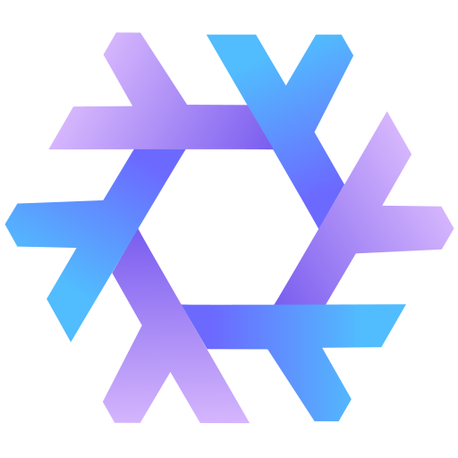

<h1>
</img>  
  sawse
</h1>

  
  
 

## config layout

- :house_with_garden: [home](../home)
- :computer: [hosts](../hosts/)
  - [hydra](../hosts/hydra/) A super mid spec laptop
  - [amatarasu](../hosts/amatarasu/) My high end gameing machine
- :electric_plug: [modules](../modules/)

 Hyprland Shortcuts 

| Shortcut | What it does |
|---|---|
| <kbd>SUPER+RETURN</kbd> | open terminal |
| <kbd>SUPER+B</kbd> | open browser |
| <kbd>SUPER+C</kbd> | open editor |
| <kbd>SUPER+O</kbd> | open notes |
| <kbd>SUPER+E</kbd> | open file manager |
| <kbd>SUPER+Q</kbd> | quit |
| <kbd>SUPER+D</kbd> | launcher |
| <kbd>SUPER+F</kbd> | fullscreen |
| <kbd>SUPER+[number]</kbd> | open workspace [number] |
| <kbd>SUPER+SHIFT+[number]</kbd> | move to workspace [number] |

## credits

- [numtide/srvos](https://github.com/numtide/srvos)
- [nullishamy](https://github.com/nullishamy/derivation-station/)
- [nekowinston](https://github.com/nekowinston/dotfiles)

