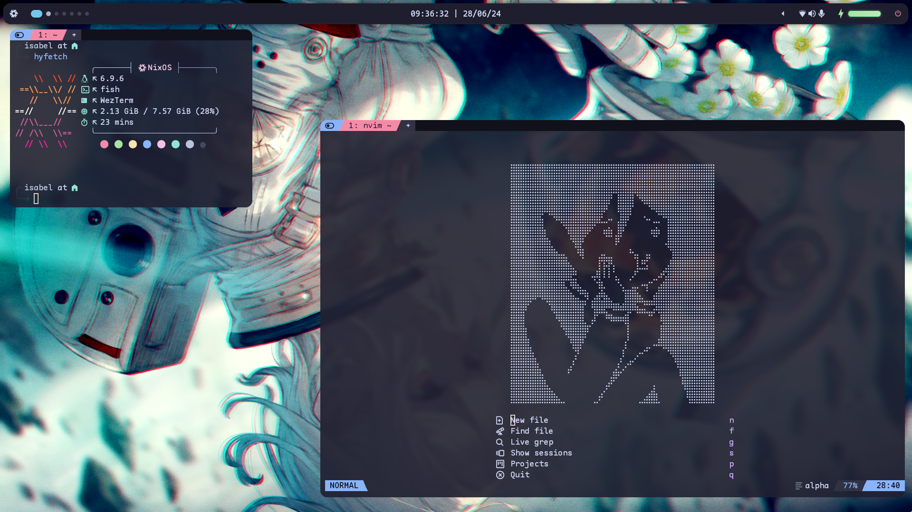
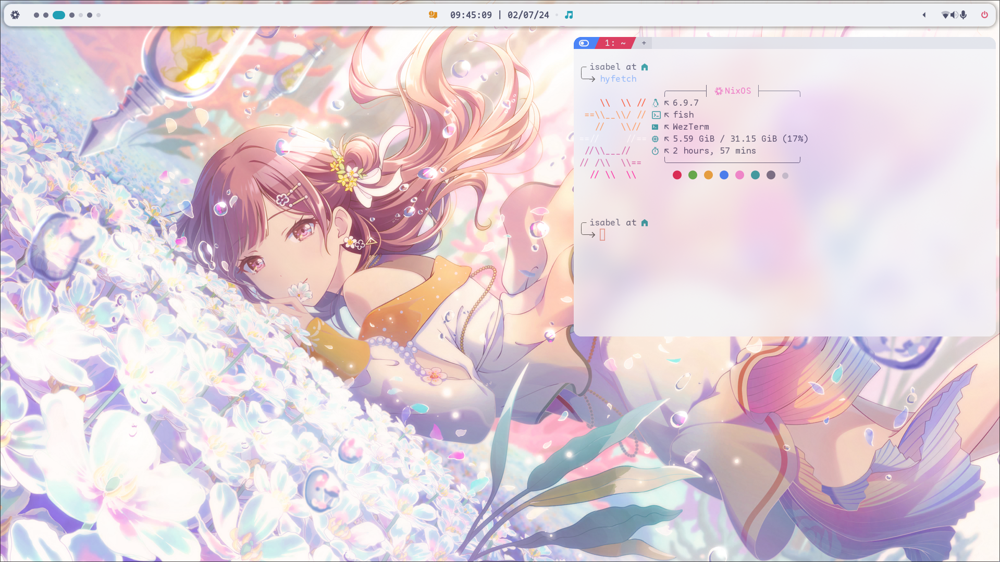
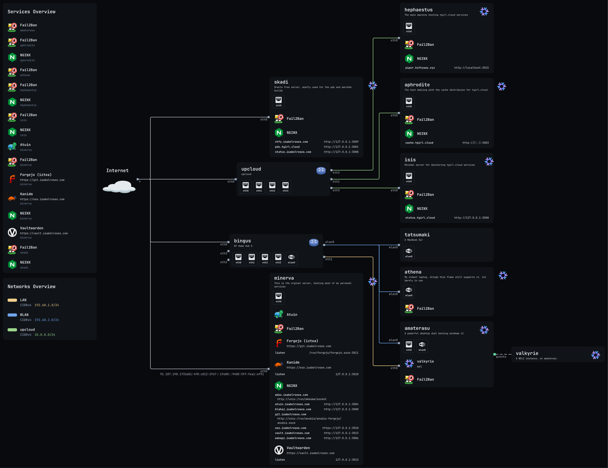

  
  <h1>isabel's dotfiles</h1>

  
  
  
  
  

 

   
more previews

   

      light mode
      
   

   

      wezterm + chromium
      
   

   

      neovim
      
   

### Foreword

This repository contains my **personal** configuration for my systems, so its really important that you know it's **personal** and not everything will fit your needs.
Therefore most things will not work out of the box without some changes, so be warned!!!!

> [!WARNING]
> Also to note that this configuration will **not** work if you do not change any of the [secrets](./secrets) since they are encrypted.

### What does this repo provided

- Several applications and tools for my needs, but you can choose the one that best suits your needs
  - `neovim`, `micro` and `vscode` for text editing
  - `firefox` and `chromium` for web browsing
  - `alacritty`, `kitty` and `wezterm` for terminal emulators
  - `bash`, `zsh`, `fish` and `nushell` for shells
- Modular configuration, so you can add or remove parts of the configuration
- Sensible defaults, so you can get started quickly
- Docs kind of
- [Catppuccin](https://github.com/catppuccin/catppuccin) everywhere, with a hint of [evergarden](https://github.com/comfysage/evergarden)

> [!NOTE]
> Please read [the documentation](https://dotfiles.isabelroses.com/)

