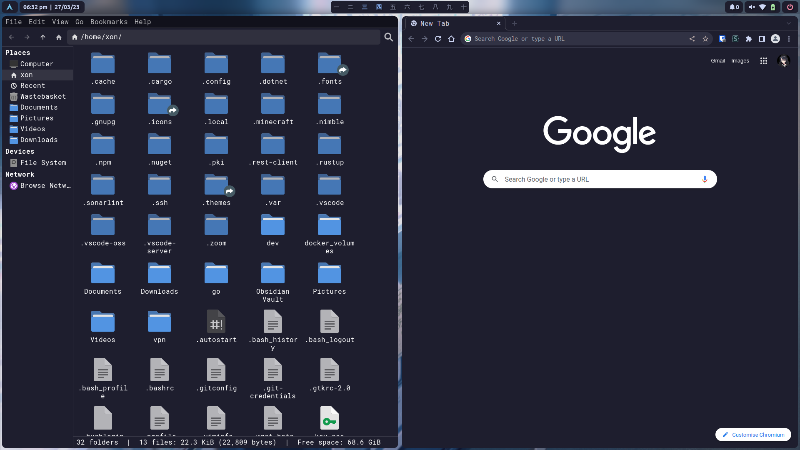
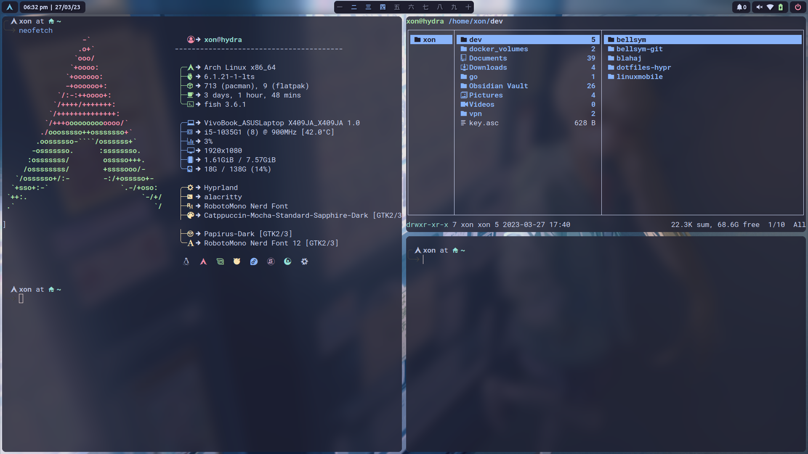
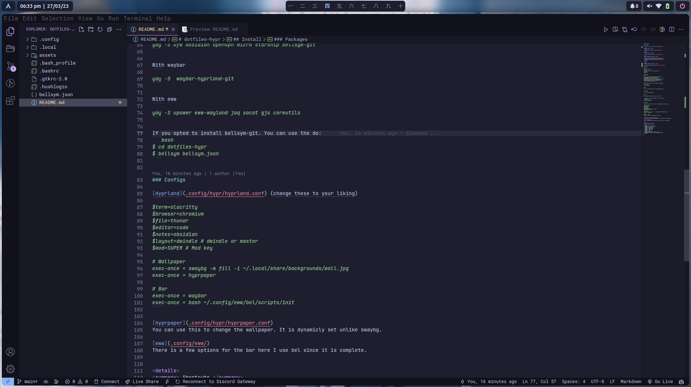

# dotfiles-hypr

### Previews

](assets/eww-bar.png)

<details>
<summary> Waybar </summary>

](assets/waybar.png)
</details>

<details>
<summary> Eww Bar </summary>

](assets/eww-bar.png)

<details>
<summary> Additional previews </summary>

](assets/quickmenu.png)
](assets/swaync.png)
](assets/datemenu.png)
</details>

</details>

<details>
<summary> Additional previews </summary>

](assets/chromium-and-thunar.png)
](assets/obsidian.png)
](assets/terminal.png)
](assets/code.png)
</details>

## Install

### paru
Run as user NOT ROOT!
```bash
git clone https://aur.archlinux.org/paru.git
cd paru
makepkg -si
```

### Packages
Base
```
paru -S hyprland-bin polkit-gnome bluez bluez-utils \
ffmpeg swaync pavucontrol thunar sddm-git \
wl-clipboard wf-recorder grimblast-git \ 
ffmpegthumbnailer playerctl noise-suppression-for-voice \
thunar-archive-plugin alacritty swaylock-effects \
nwg-look-bin pamixer rofi-lbonn-wayland-git wlogout fish  \
```

#### Themeing
```
paru -S papirus-folders-catppuccin-git catppuccin-gtk-theme-mocha catppuccin-cursors-mocha
```

Backgrounds (choose one or both `default is hyprpaper`)
```
paru -S swaybg
paru -S hyprpaper
```

Addons
```
paru -S ufw obsidian openvpn micro starship bellsym-git 
```

With waybar
```
paru -S  waybar-hyprland-git 
```

With eww
```
paru -S upower eww-wayland jaq socat gjs coreutils
```

If you opted to install bellsym-git. You can use the do:
```bash
$ cd dotfiles-hypr
$ bellsym bellsym.json
```

### Configs

[Hyprland](.config/hypr/hyprland.conf) (change these to your liking)
```
$term=alacritty
$browser=chromium
$file=thunar
$editor=code
$notes=obsidian
$layout=dwindle # dwindle or master
$mod=SUPER # Mod key

# Wallpaper
exec-once = swaybg -m fill -i ~/.local/share/backgrounds/wall.jpg
exec-once = hyprpaper

# Bar
exec-once = waybar
exec-once = bash ~/.config/eww/bel/scripts/init
```

[hyprpaper](.config/hypr/hyprpaper.conf)
You can use this to change the wallpaper. It is dynamicly set unlike swaybg. 

[eww](.config/eww/)
There is a few options for the bar here I use bel since it is complete.


<details>
<summary> Shortcuts </summary>

| Shortcut   | What it does   |
|---|---|
| `SUPER+RETURN` | open terminal |
| `SUPER+B` | open browser |
| `SUPER+C` | open editor |
| `SUPER+O` | open notes |
| `SUPER+E` | open thunar |
| `SUPER+Q` | quit |
| `SUPER+D` | rofi |
| `SUPER+F` | fullscreen |
| `SUPER+[number]` | open workspace [number] |
| `SUPER+SHIFT+[number]` | move to workspace [number] |
</details>