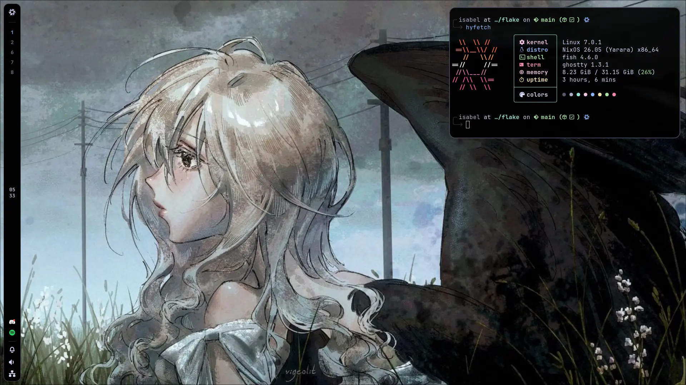
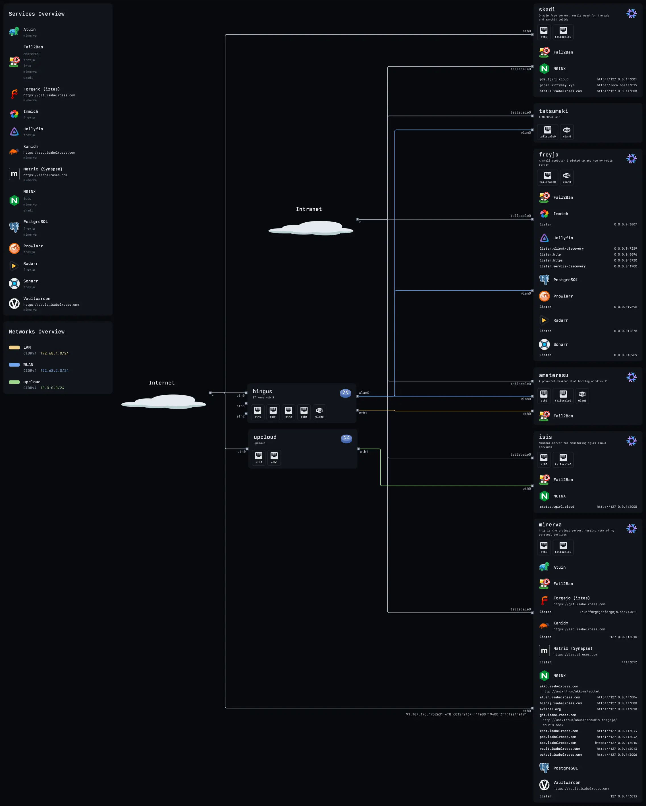

  <h1>isabel's dotfiles</h1>

 

### Foreword

This repository contains my **personal** configuration for my systems, so its really important that you know it's **personal** and not everything will fit your needs.
Therefore most things will not work out of the box without some changes, so be warned!!!!

> [!WARNING]
> Also to note that this configuration will **not** work if you do not change any of the [secrets](./secrets) since they are encrypted.

### What does this repo provided

- Modular configuration, so you can add or remove parts of the configuration
- Sensible defaults, so you can get started quickly
- Docs kind of
- [Catppuccin](https://github.com/catppuccin/catppuccin) everywhere.

> [!NOTE]
> Please read [the documentation](https://dotfiles.isabelroses.com/)

